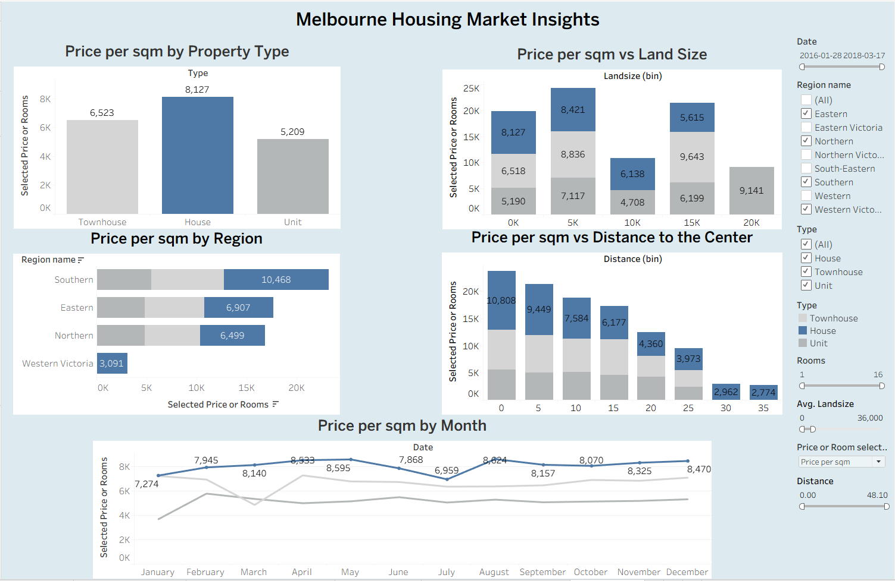
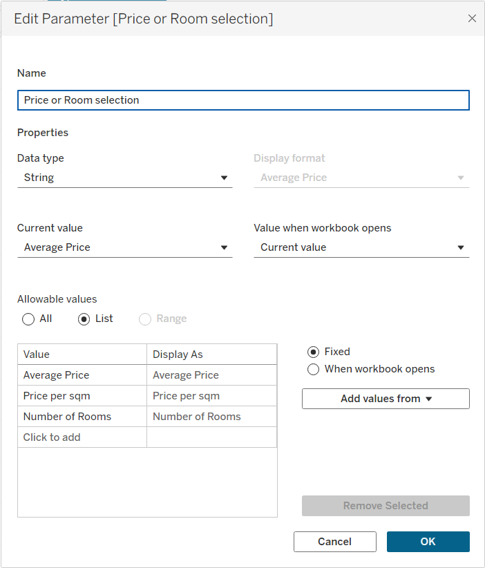

# 🏠 Tableau Dashboard Project: Melbourne Housing Market  

 
 


**Prepared by:** Jose De Leon  
**Date:** June 27, 2025  

---

## 📊 Project Overview  
This project explores the **Melbourne housing market** through an interactive Tableau dashboard built on 20,993 property sales records. The dashboard provides insights into housing prices, property characteristics, and market dynamics using parameter-driven storytelling and interactive filters.  

Key features include:  
- Five dynamic visualizations (bar, histogram, line, and stacked plots).  
- A parameter that toggles between **Average Price, Price per sqm, and Number of Rooms**.  
- Interactive filters for **Region, Property Type, Rooms, Land Size, Distance, and Time**.  
- A unified dashboard displaying all visualizations for holistic analysis.  

This project demonstrates strong capabilities in **Tableau, parameter-driven analysis, and real estate market insights**.  

---

## 📂 Project Files  
- [`Dashboard - Melbourne Housing`](Dashboard%20-%20Melbourne%20Housing%20-%20github.twbx)  
- [`Dataset`](melbourne_housing_cleaned.csv)  
- [`Plots`](plots/)  
- [`Project Tableau Dashboard PDF`](Project%20Tableau%20Dashboard%20Melbourne.pdf)  
- [`LICENSE`](LICENSE)  
- [`README.md`](README.md)  

---

## 📸 Dashboard Demonstration  



🔗 [View Full Dashboard on Tableau Public](https://public.tableau.com/app/profile/josedeleon-analytics/viz/MelbourneHousingDashboard/Dashboard)  

---

## 🔍 Visualizations  

### 1. Average Price by Property Type  
  

### 2. Price per sqm by Property Type  
  

### 3. Average Price by Region  
  

### 4. Price per sqm by Region  
  

### 5. Number of Rooms vs Land Size  
  

### 6. Average Price vs Distance to the Center  
  

### 7. Average Price by Month  
  


---

## ⏳ Parameter & Calculated Fields  

### 📌 Parameter: Price or Room selection 
- **Price or Room Selection Parameter**  
  This parameter allows users to toggle between three perspectives:  
- **Average Price**  
- **Price per sqm**  
- **Number of Rooms**  
   

- **Dynamic Titles (Calculated Fields)**  
  Each visualization title updates dynamically depending on the parameter selection:  
  - Property Type  
  - Region  
  - Land Size  
  - Distance to Center  
  - Month  

### 📌 Calculated Field: Selected Price or Rooms  
This field drives the metric shown across all visualizations, dynamically switching based on the parameter selection.  

```tableau
IF [Price or Room selection] = "Average Price" THEN AVG([Price])
ELSEIF [Price or Room selection] = "Number of Rooms" THEN MEDIAN([Rooms])
ELSEIF [Price or Room selection] = "Price per sqm" THEN
    AVG([Price]) / NULLIF(AVG([Building Area]), 0)
END
```
